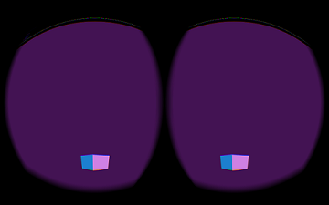
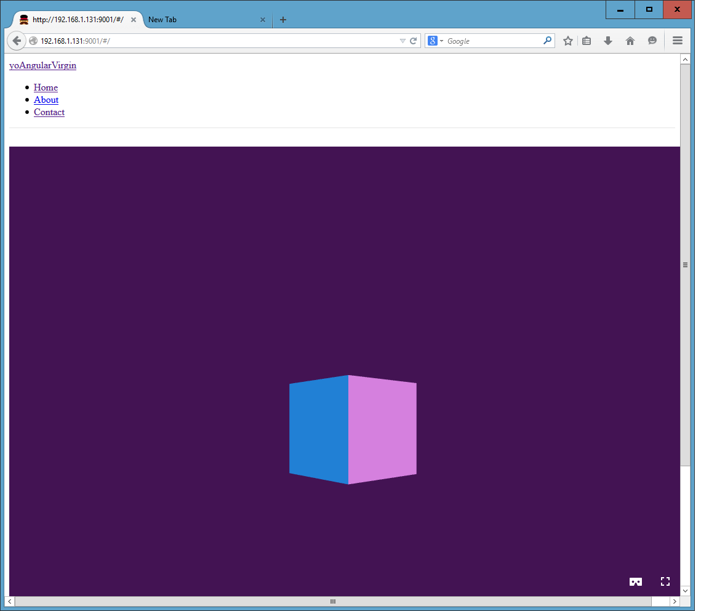
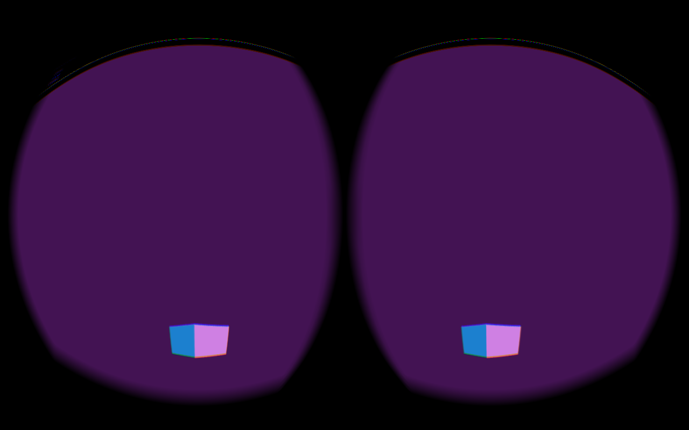

# generator-webvr-decorator 

## Introduction
Yeoman webvr-decorator generator - Adds [WebVR](http://webvr.info/) capability to an existing (angular) application.
> 
> Note: currently only applications generated with the [angular generator](https://github.com/yeoman/generator-angular#readme) are supported.  But this generator has been designed to accommodate multiple application formats.  Additional application formats such as [Webapp](https://github.com/yeoman/generator-webapp#readme) and *Angular 2* are planned for the future.

WebVR and three.js are powerful platforms.  When running together, these libraries allow you create full VR-enabled web applications that run directly on any WebVR enabled browser.  When you click on the "WebVR" full-screen icon of a running application, you will generate a split-screen view suitable for viewing on a VR head-mounted display such as Oculus Rift, or Google Cardboard.

Unfortunately, both WebVR and three.js involve large amounts of tedious boilerplate.  If you've never created a WebVR app before, it may take you several days to figure what needs to be done as documentation is sparse.  Even experienced WebVR application developers may find it takes several hours to set up a basic application, particularly when you have to integrate it into a non-trivial platform such as Angular.

webvr-decorator allows you to inject the necessary code into an existing application, in the form of an independent MVC *subapp*, that allows you to display a [basic VR enabled scene of a rotating cube](http://vt5491.github.io/#/).  And by using a generator, you get a simple but useful skeleton architecture utilizing standard WebVR and THREE.js best practices, providing a solid foundation on which you can build your own VR capability, and integrate into your existing application.

## Getting Started

```bash
npm install -g generator-webvr-decorator
```
Install your basic target application.  For example, angular [(see here for how to generate an angular application)](https://github.com/yeoman/generator-angular#readme)

Make sure you are in the directory that has the application you wish to "decorate" with WebVR:
```
cd /path/to/my/app
```
Run the generator
```bash
yo webvr-decorator
```
This generates the following:

```bash
     _-----_
    |       |    .--------------------------.
    |--(o)--|    |      Welcome to the      |
   `---------´   |      webvr-decorator     |
    ( _´U`_ )    |        generator!        |
    /___A___\    '--------------------------'
     |  ~  |     
   __'.___.'__   
 ´   `  |° ´ Y ` 

This generator will add WebVR capability to a previously installed angular app.


We will add several artifacts in the form of an MVC resource: one controller, three services, and one directive.
Please specify artifact names in camelCase.

? please specify any artifact name you wish to override, or just press ENTER to accept the defaults: (Press <space> to s
elect)
❯◯ --- controllers ---
 ◯ main
 ◯ --- services ---
 ◯ main
 ◯ base
 ◯ utils
 ◯ --- directives ---
 ◯ canvaskeys

```
If you are *decorating* a vanilla angular app, and you basically want a stand-alone VR app, then it's probably easiest to just accept the defaults.

However, for the rest of this demonstration we will assume you want to add the WebVR capability as a separate "MVC subsystem" on top of an angular app that already has other functionality (in the 'main' controller and service, for example).  So in this case we want to rename the following:

- main controller --> 'myVRSubApp'
- main service    --> 'myVRSubApp'
- base service    --> 'myVRSubAppBase'
- utils services  --> 'myVRSubAppUtils'

We will use the default name for the keyboard handling directive (canvasKeys.js)

Note: Enter names as camelCase.  Angular has very picky requirements regarding names, as it uses extensive "name-mangling" conventions to identify resources.  

So select the artifacts by using the arrow-keys to go down the list and press the *space bar* on the items you wish to select:

```bash
? please specify any artifact name you wish to override, or just press ENTER to accept the defaults: 
 ◯ --- controllers ---
 ◉ main
 ◯ --- services ---
 ◉ main
 ◉ base
❯◉ utils
 ◯ --- directives ---
 ◯ canvaskeys

```
You will then be prompted for the new names:
```bash
? please specify any artifact name you wish to override, or just press ENTER to accept the defaults: main, main, base, utils
? new name for main ctrl: myVRSubApp
? new name for main service: myVRSubApp
? new name for base service: myVRSubAppBase
? new name for utils service: myVRSubAppUtils
```
The generator will confirm if you wish to continue:
```bash
? We will now add webVR capability to this application. Do you wish to continue? (Y/n)
```
The generator will update several files.  It will ask for permission first.  Reply with 'y' to update a single file, or specify 'a' to update all files:
```bash
? We will now add webVR capability to this application. Do you wish to continue?
switch: found unknown key:continue
   create app/scripts/services/myvrsubapp.js
   create app/scripts/services/myvrsubappbase.js
   create app/scripts/services/myvrsubapputils.js
identical test/spec/services/myvrsubapp.js
identical test/spec/services/myvrsubappbase.js
identical test/spec/services/myvrsubapputils.js
   create app/scripts/controllers/myvrsubapp.js
identical test/spec/controllers/myvrsubapp.js
   create app/scripts/directives/canvaskeys.js
identical test/spec/directives/canvaskeys.js
undefined
 conflict app/scripts/services/myvrsubapp.js
? Overwrite app/scripts/services/myvrsubapp.js? overwrite this and all others
    force app/scripts/services/myvrsubapp.js
    force app/scripts/services/myvrsubappbase.js
    force app/scripts/services/myvrsubapputils.js
    force app/scripts/controllers/myvrsubapp.js
    force app/scripts/directives/canvaskeys.js
    force app/index.html
    force app/scripts/app.js
    force app/lib/README.md
    force app/views/myvrsubapp.html
app.install: now installing threejs
app.install: now installing threejs
app.install: now installing webvr-boilerplate

```
Note: the libraries, particularly the three.js libraries can take on the order of several minutes to install:
```bash
bower threejs#*             not-cached git://github.com/mrdoob/three.js.git#*
bower threejs#*                resolve git://github.com/mrdoob/three.js.git#*
bower threejs#*               checkout master
bower threejs#*               progress Receiving objects:  40% (784/1917), 14.13 MiB | 2.10 MiB/s
bower threejs#*               progress Receiving objects:  41% (786/1917), 14.13 MiB | 2.10 MiB/s
bower threejs#*               progress Receiving objects:  41% (801/1917), 18.59 MiB | 2.22 MiB/s
bower threejs#*               progress Receiving objects:  41% (805/1917), 20.61 MiB | 2.16 MiB/s
bower threejs#*               progress Receiving objects:  42% (806/1917), 20.61 MiB | 2.16 MiB/s
bower threejs#*               progress Receiving objects:  42% (808/1917), 22.73 MiB | 2.16 MiB/s
bower threejs#*               progress Receiving objects:  42% (809/1917), 24.88 MiB | 2.14 MiB/s
bower threejs#*               progress Receiving objects:  42% (809/1917), 27.05 MiB | 2.12 MiB/s
bower threejs#*               progress Receiving objects:  42% (812/1917), 29.28 MiB | 2.14 MiB/s
bower threejs#*               progress Receiving objects:  43% (835/1917), 32.31 MiB | 2.00 MiB/s
bower threejs#*               progress Receiving objects:  44% (844/1917), 34.01 MiB | 2.14 MiB/s
```
The installer is done once you see these messages:
```bash
webvr-decorator: all done
sub-angular: all done
```
For some reason, the installer doesn't always exit at the end.  You can hit Ctrl-C after seeing these messages if it appears your terminal is "hung".
After the required libraries are installed, start your angular app like always:
```bash
grunt serve
```

The webVR enabled rotating cube scene will be at the following URL:
```bash
http://localhost:9000/#/ (if you used default names)
http://localhost:9000/#/myVRSubApp (if you over-rode names)
```
The application supports WASD keys to move around:
```bash
w: move camera forward
s: move camera backward
d: move camera right
a: move camera left
e: rotate cube clockwise
q: rotate cube counter-clockwise
```
## Caveats:

- It is recommended you backup the **app** directory structure of your application, or simply use a *vanilla* angular install (base yeoman angular template app with no modifications)
before *decorating* it, particularly if you are using the default names.  While this is less important if you're doing a "separate MVC" install (using different names), there are still some files common files, such as index.html, that of necessity need to be updated.  While I have tested the changes on several of my own apps, and yeoman is fairly good about preventing an installer from trashing your app, it's just common sense to do until this installer gets more "real-world" usage, or at least until you gain more personal experience with it. 

- I primarily tested on a laptop.  It runs on mobile, but there is a problem where the *VR icon* rapidly shrinking that makes it hard to enter VR Mode.

- The arrow keys do not work when selecting options on Microsoft Windows (either the git bash shell, or command prompt).  This appears [to be a known problem with the Windows version Yeoman](https://github.com/strongloop/generator-loopback/issues/69). 

## Screen-Shots
The following were run on [Mozilla nightly build](https://nightly.mozilla.org/)

pre VR expansion:



with VR expansion:


Running app available [here](http://vt5491.github.io/#/)

## Additional
Skip installing the libraries (useful if running multiple times):

```bash
yo webvr-decorator --skipInstall
```

## History
v0.2.x First released 2015-01-27:

- added ability to override names.
- improved documentation.
- fixed various minor bugs found during testing.

v0.1.5: Released 2014-12-07:

- Basic working form.

## License

MIT


